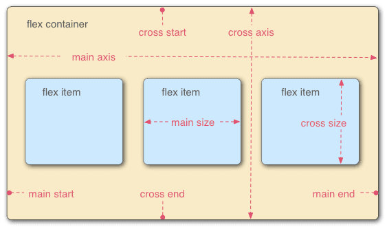

# 弹性布局

## 坐标轴

## 属性

- flex-direction
- flex-wrap
- flex-flow
- justify-content
- align-items
- align-content

### flex-direction

flex-direction 用于决定主轴的方向

> flex-direction: row | row-reverse | column | column-reverse;

### flex-wrap

flex-wrap 用于定义换行方式

> flex-wrap: nowrap | wrap | wrap-reverse;

### justify-content

justify-content 用于定义主轴上的对齐方式

> justify-content: flex-start | flex-end | center | space-between | space-around;

### align-items

align-items 用于定义在交叉轴上如何对齐

> align-items: flex-start | flex-end | center | baseline | stretch;

### align-content

align-content 用于定义多轴线的对齐方式 若仅有一根轴线 则不起作用

