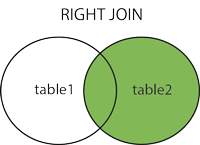

# JOIN

join 用于表连接

- **INNER JOIN（内连接,或等值连接）**：获取两个表中字段匹配关系的记录。
- **LEFT JOIN（左连接）：**获取左表所有记录，即使右表没有对应匹配的记录。
- **RIGHT JOIN（右连接）：** 与 LEFT JOIN 相反，用于获取右表所有记录，即使左表没有对应匹配的记录。

on 用来表示，两表连接的条件，所以包含了多表的信息，

区别where，where可以不包含两表信息。

## INNER JOIN

## LEFT JOIN

## RIGHT JOIN

## FULL OUTER JOIN

